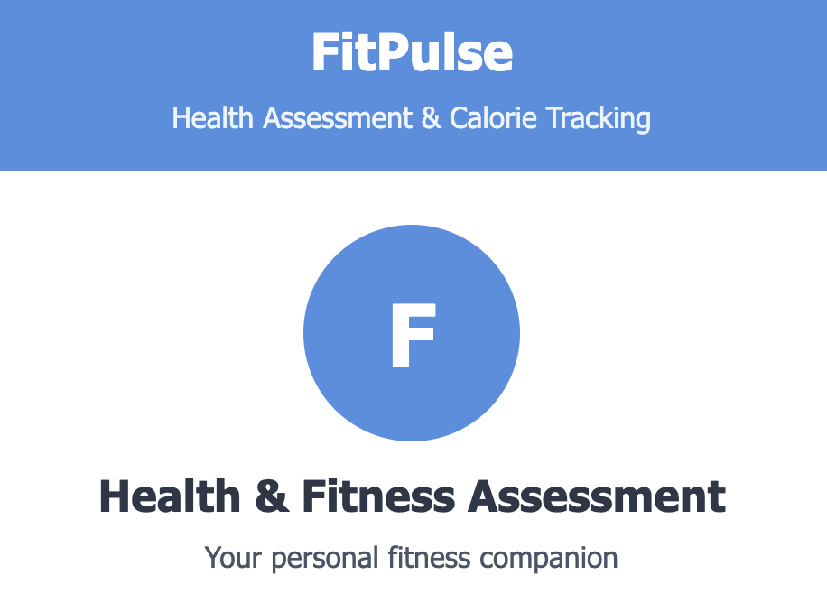

# FitPulse - Health Assessment & Calorie Tracking App

FitPulse is a privacy-focused web application that provides personalized health assessments, calorie recommendations, and fitness advice without requiring account creation or storing any personal data.



## Features

- **Privacy-First Approach**: All calculations happen on your device - no data is stored or transmitted
- **Health Score Visualization**: Visual health score with classification based on multiple metrics
- **BMI Calculator**: Calculates and categorizes BMI (Body Mass Index)
- **Calorie Tracking**: Estimates BMR, TDEE, and recommended calorie intake
- **Macronutrient Breakdown**: Calculates optimal protein, carbs, and fat intake
- **Personalized Recommendations**: Tailored fitness and nutrition advice based on your profile
- **PDF Export**: Generate and download a professional PDF report of your results

## Demo

Try the live demo: [FitPulse Demo](https://fitpulse-ai.netlify.app/)

## Getting Started

### Prerequisites

- Web browser (Chrome, Firefox, Safari, or Edge recommended)
- No server-side requirements - FitPulse runs entirely in the browser

### Installation

1. Clone this repository:

   ```bash
   git clone https://github.com/yourusername/fitpulse.git
   ```

2. Navigate to the project directory:

   ```bash
   cd fitpulse
   ```

3. Open `index.html` in your browser:

   ```bash
   # On macOS
   open index.html

   # On Linux
   xdg-open index.html

   # On Windows
   start index.html
   ```

Alternatively, you can use a local development server like Live Server in VS Code.

## How It Works

### Health Score Calculation

The health score is calculated based on several factors:

- BMI (Body Mass Index)
- Activity level
- Age
- Weight
- Height

The scoring algorithm assigns a base score of 50 points, with additional points added for:

- Normal BMI range (+20 points)
- Higher activity levels (up to +25 points)

The final score is classified as:

- 0-49: Needs Improvement
- 50-69: Fair
- 70-84: Good
- 85-100: Excellent

### Calorie & Macronutrient Calculations

- **BMR (Basal Metabolic Rate)**: Calculated using the Mifflin-St Jeor Equation
- **TDEE (Total Daily Energy Expenditure)**: BMR adjusted with activity multiplier
- **Recommended Calorie Intake**: TDEE adjusted based on goal (weight loss, maintenance, or gain)
- **Macronutrient Breakdown**:
  - Protein: 30% of daily calories (4 calories per gram)
  - Carbohydrates: 45% of daily calories (4 calories per gram)
  - Fats: 25% of daily calories (9 calories per gram)

## Project Structure

```
fitpulse/
├── index.html         # Main HTML file
├── styles.css         # CSS styles
├── script.js          # JavaScript functionality
├── screenshot.png     # App screenshot
├── LICENSE            # License information
└── README.md          # This documentation
```

## Customization

### Modifying the Health Score Algorithm

To modify the health score calculation, edit the `calculateResults()` function in `script.js`:

```javascript
// Health score calculation
let healthScoreValue = 50; // Base score

// Add points for normal BMI
if (bmi >= 18.5 && bmi < 25) healthScoreValue += 20;
else if (bmi >= 25 && bmi < 30) healthScoreValue += 10;

// Add points for activity level
if (activityLevel === 1.2) healthScoreValue += 0;
else if (activityLevel === 1.375) healthScoreValue += 10;
else if (activityLevel === 1.55) healthScoreValue += 15;
else if (activityLevel === 1.725) healthScoreValue += 20;
else if (activityLevel === 1.9) healthScoreValue += 25;
```

### Changing the Macronutrient Ratio

To modify the macronutrient distribution, adjust these values in `script.js`:

```javascript
// Calculate macronutrients
// Protein: 30%, Carbs: 45%, Fats: 25%
const proteinCalories = recommendedCaloriesValue * 0.3;
const carbsCalories = recommendedCaloriesValue * 0.45;
const fatsCalories = recommendedCaloriesValue * 0.25;
```

## PDF Export Functionality

FitPulse generates professional PDF reports using the following libraries:

- [jsPDF](https://github.com/parallax/jsPDF) - Client-side PDF generation
- [html2canvas](https://github.com/niklasvh/html2canvas) - HTML rendering to canvas

The PDF includes:

- Health score and classification
- Personal metrics (age, weight, height, gender, BMI)
- Calorie and macronutrient details
- Personalized recommendations

## Browser Compatibility

- Chrome (latest)
- Firefox (latest)
- Safari (latest)
- Edge (latest)

## Limitations

- Calculations are based on general formulas and should not replace professional medical or nutritional advice
- The app performs best on desktop and tablet devices due to the detailed data visualizations
- Internet connection is required for the initial page load and PDF export functionality

## Contributing

Contributions are welcome! Please feel free to submit a Pull Request.

1. Fork the repository
2. Create your feature branch (`git checkout -b feature/amazing-feature`)
3. Commit your changes (`git commit -m 'Add some amazing feature'`)
4. Push to the branch (`git push origin feature/amazing-feature`)
5. Open a Pull Request

## License

This project is licensed under the MIT License - see the LICENSE file for details.

## Acknowledgments

- [Mifflin-St Jeor Equation](https://en.wikipedia.org/wiki/Basal_metabolic_rate#BMR_estimation_formulas) for BMR calculations
- [jsPDF](https://github.com/parallax/jsPDF) for PDF generation
- [html2canvas](https://github.com/niklasvh/html2canvas) for HTML to canvas conversion

## Contact

Your Name - Prateek Choudavarpu

Project Link: [https://github.com/prateek10201/FitPulse](https://github.com/prateek10201/FitPulse)

Website Link: [https://fitpulse-ai.netlify.app/](FitPulse)
